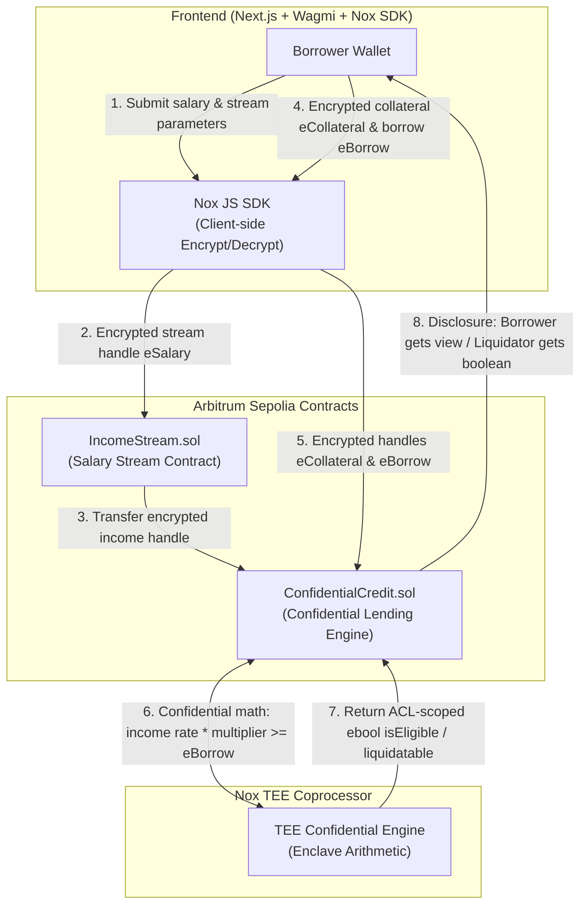

# Nox Private Credit — System Architecture & Design Specification

## 1. Overview & Core Mission
**Nox Private Credit** is an institutional-grade, privacy-preserving lending protocol deployed on Arbitrum Sepolia. It enables employees to underwrite confidential Aave-style loans against continuous Sablier/Superfluid-style salary streams. 

Neither the user's monthly salary rate nor their current loan position size is ever exposed on-chain. All financial arithmetic and risk evaluations are computed confidentially via **Nox TEE (Trusted Execution Environment)** confidential compute handles and ACL-scoped boolean signals.

---

## 2. Two-Contract System Architecture



### 2.1 `IncomeStream.sol`
- **Purpose:** Simulates/integrates continuous salary streaming (Sablier/Superfluid pattern) while maintaining confidential balance handles.
- **State & Handles:**
  - `mapping(address => euint64) private _encryptedMonthlyRate`: Encrypted monthly salary rate.
  - `mapping(address => euint64) private _encryptedTotalEarned`: Encrypted running balance of salary earned to date.
- **Key Functions:**
  - `createStream(address employee, inEuint64 encryptedRateHandle)`: Initiates a confidential salary stream.
  - `getIncomeHandle(address employee)`: Returns the encrypted `euint64` handle representing income rate for credit underwriting. Emits `EncryptedEarnedHandleEmitted`.

### 2.2 `ConfidentialCredit.sol`
- **Purpose:** Manages collateral deposits, confidential eligibility checks, borrow positions, repayments, and liquidation signals.
- **State & Handles:**
  - `mapping(address => euint64) private _encryptedCollateral`: Encrypted user collateral balance.
  - `mapping(address => euint64) private _encryptedBorrowBalance`: Encrypted active borrow principal.
  - `mapping(address => ebool) private _encryptedLiquidationStatus`: TEE-computed liquidation boolean.
- **Key Functions:**
  - `depositCollateral(inEuint64 encryptedAmount)`: Accepts encrypted collateral.
  - `requestBorrow(inEuint64 encryptedBorrowAmount, address streamContract)`: Queries `IncomeStream` handle, executes confidential underwriting evaluation in Nox TEE, updates borrow balance if eligible.
  - `repay(inEuint64 encryptedRepayAmount)`: Reduces encrypted borrow principal.
  - `checkLiquidation(address borrower)`: TEE evaluates health factor against liquidation threshold and discloses boolean `liquidatable` to authorized liquidators.

---

## 3. Underwriting & Liquidation Mathematics

### 3.1 Confidential Underwriting Rule
The protocol enforces a forward-salary multiplier rule:
$$\text{Max Borrow Capacity} = \text{Monthly Income Rate} \times \text{Credit Multiplier (e.g., 6)}$$

In Nox Confidential Compute:
```solidity
// TEE Encrypted Arithmetic
euint64 maxBorrowCapacity = Nox.mul(incomeRateHandle, CREDIT_MULTIPLIER);
ebool qualifies = Nox.gte(maxBorrowCapacity, requestedBorrowHandle);
```
The result `qualifies` is stored as an `ebool`. Only the boolean result is revealed to the protocol decision logic; the borrower's raw salary and requested loan size remain completely sealed.

### 3.2 Confidential Liquidation Rule
Liquidation status is evaluated in TEE as:
$$\text{Health Factor} = \frac{\text{Collateral Value} + (\text{Monthly Income Rate} \times \text{Safety Factor})}{\text{Active Loan Balance}}$$

$$\text{Liquidatable Flag} = (\text{Health Factor} < \text{Liquidation Line})$$

In Nox TEE execution, this yields a boolean signal `liquidatable: true/false`. 
- **Public / Liquidator view:** Liquidators receive **only** the `bool` signal (`true`/`false`).
- **Position privacy:** Liquidators trigger `liquidate(borrower)` based strictly on `true`, without ever learning whether the loan was $5,000 or $5,000,000.

---

## 4. Access Control List (ACL) Matrix

| Entity / Role | Monthly Income (`eSalary`) | Collateral (`eCollateral`) | Loan Position (`eBorrow`) | Eligibility Result | Liquidation Signal |
| --- | --- | --- | --- | --- | --- |
| **Borrower** | Full Decrypt (`decrypt`) | Full Decrypt (`decrypt`) | Full Decrypt (`decrypt`) | Full View | Full View |
| **Protocol Contract** | Encrypted Handle | Encrypted Handle | Encrypted Handle | `ebool` Handle | `ebool` Handle |
| **Liquidator / Public** | ❌ No Access | ❌ No Access | ❌ No Access | ❌ No Access | Plaintext `bool` (via ACL reveal) |
| **Auditor Role** *(Optional)* | Granted View (via ACL) | Granted View (via ACL) | Granted View (via ACL) | Full View | Full View |

---

## 5. Scope Boundaries: Mocked vs. Real Components

To ensure a 100% working, bulletproof demo on **Arbitrum Sepolia**:

| Component | Scope Decision | Rationale |
| --- | --- | --- |
| **Nox Confidential Engine (`@iexec-nox`)** | **100% REAL** | Core hackathon judging criterion. Full encrypt → handle → TEE compute → ACL decrypt round-trip. |
| **Arbitrum Sepolia Deployment** | **100% REAL** | Verified live testnet deployment. |
| **Nox JS SDK Integration** | **100% REAL** | Client-side input encryption & wax-seal disclosure UI. |
| **Sablier / Superfluid Payroll** | **Mocked Interface** | Local contract implementation (`IncomeStream.sol`) simulating streaming balance updates. |
| **Aave Liquidity Pool Vault** | **Mocked Interface** | Integrated pool logic within `ConfidentialCredit.sol` for token deposit/borrow actions. |
